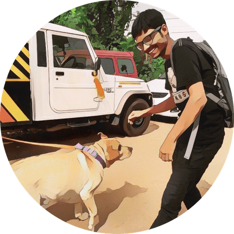

Debagnik Kar
============

Profile
-------

I'm an Electronics and Telecommunication Engineer
[Badges](https://www.youracclaim.com/users/debagnik-kar/badges)

* * *

### About me

I am an electronics and telecommunication engineering with keen interest in IoT, Cloud Computing and Web Technologies. I am also an embedded system developer with good knowledge in various programming languages such as C/C++, and Python 3. I love structure and order, and like to spend time in fixing little details. I am open-minded to new ideas, I like to collaborate in a team effort, it makes learning more fun and takes less time.

### Details

**Name:**  
Debagnik Kar  
**Age:**  
22 years(2022)  
**Location:**  
Patia, Bhubaneswar, Odisha, INDIA  

Experiences
-----------

### Education

#### KIIT School of Electronics Engineering

Apr 2022 (Currently pursuing)  
Jun 2018

**Course - B.Tech (Electronics and Telecommunication), GPA:7.82** B.Tech is an undergraduate academic degree conferred after completion of a 4 year programme of studies at an accredited University. In India B.Tech and B.Eng. are identical and is a 3 – 4 years of academic course depending on the previous level of education. Bhubaneswar, Odisha, India.

#### Midnapore Collegiate School

Apr 2016  
Jun 2018

**Course: WBCSHE-Science (HSE), GPA: 6.78** West Bengal Council of Higher Secondary Education is a state controlled council for Higher Secondary Education. I graduated HSE in science track which consists of the subjects Advanced Physics, Chemistry and Mathematics along with English and Bengali language and literature, with an optional elective, (Digital Electronics and Computer Science in my case). Midnapore, West Bengal, India

#### Dooars International Public School

May 2014  
Jun 2016

**Course: CBSE-Standard Secondary Education, GPA: 7.4** Central Board of Secondary Education is a council controlled by the union government of India and is responsible for conducting examination for HSE and SE students, It follows the curriculum provided by NCERT which included subjects like Science (physics, chemistry, biology), Mathematics, Social Sciences (Geography, History, Political Sciences and economics), English, Bengali, IT Fundamentals and Disaster management. Cooch Behar, West Bengal, India

Abilities
---------

* * *

### Skills

*   Computer Programming
*   Embedded Systems
*   Internet of Things
*   Cryptography
*   Cybersecurity and ethical hacking
*   Computer Networking
*   Cloud Computing
*   Web Technologies
*   Database Management
*   Blockchain
*   IT and Tech Support
*   Operating Systems
*   Robotic Process Automation
*   Computer Simulation
*   Video Editing
*   Object Oriented Programming
*   SEO/SMO, DigiMarketing
*   Data Science and Analysis
*   Machine Learning
*   Version Control
*   VLSI Design
*   Digital Signal Processing

  

My project are mostly made public to Github, Have a look

[See projects on Github](https:github.com/Debagnik)

* * *

### Langauges

*   Bangla (Mother Tongue)
*   English (Daily Use)
*   Hindi (Can communicate)
*   Japanese (アニメから日本語を学びました)

### Tools

*   C/C++ (GCC/G++)
*   Python 3
*   Embedded C
*   Arduino IDE
*   Visual Studio Code
*   Kali-Linux
*   Cryptool 2
*   Cisco Packer Tracer
*   Amazon Web Services
*   Google Cloud Platform
*   MySQL
*   Redis
*   Blockchair
*   WindowsOS (XP to 10)
*   Microsoft Office Suite
*   Ubuntu OS (Desktop/Server)
*   Cent OS (Desktop/Server)
*   Real-Time OS (RTOS)
*   Robotics OS
*   UI Path
*   Cyberlink PowerDirector 18
*   Google analytics
*   Inspectlet
*   Notepad ++
*   MATLAB
*   Git/Github
*   HTML 5.0
*   CSS 3.0
*   JavaScript
*   Proteus Pro 8
*   Easy EDA
*   System Verilog
*   Processing 3 IDE (Java)
*   ATT M2X
*   ThinkSpeak
*   Wire Shark

Contact
-------

“You can't cross the ocean merely by standing and staring at the water  
\-Rabindranath Tagore, (Noble prize acceptance speech)

* * *

*    [ Follow on Instagram](https://www.instagram.com/rak_kingabed/)
*   [Connect using Linkedin](https://linkedin.com/in/debagnikkar)
*   [Explore my projects on Github](https://github.com/Debagnik)

*   [Subscribe me on Youtube](https://www.youtube.com/channel/UC5TJ5j8xY9f-LNT2TbQpttQ)
*   [Stream my music at Spotify](https://open.spotify.com/artist/5dFq7tR1ZJpQLnUvmS4oK5)
*   [Send an Email to me](mailto:1804373@kiit.ac.in)

* * *

©Debagnik Kar 2020  
Made with ❤ at KIIT
